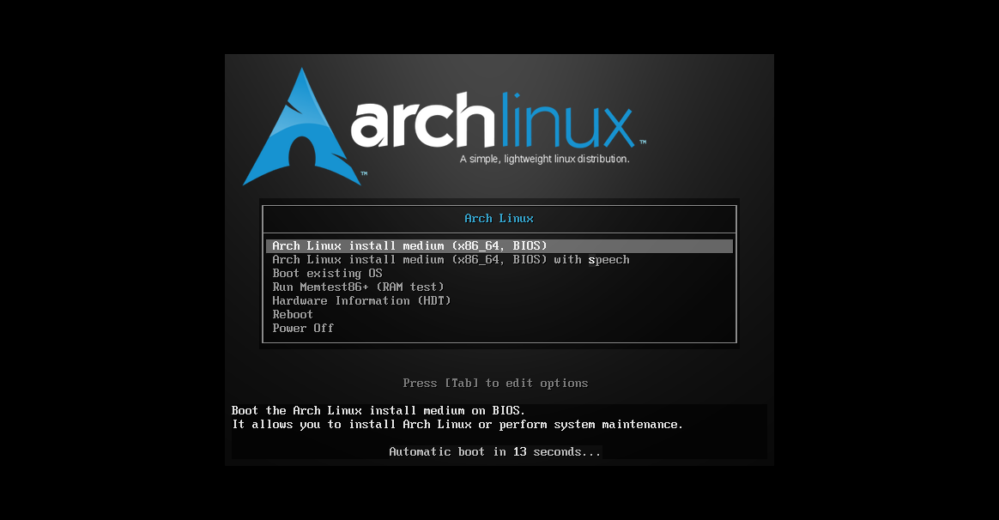
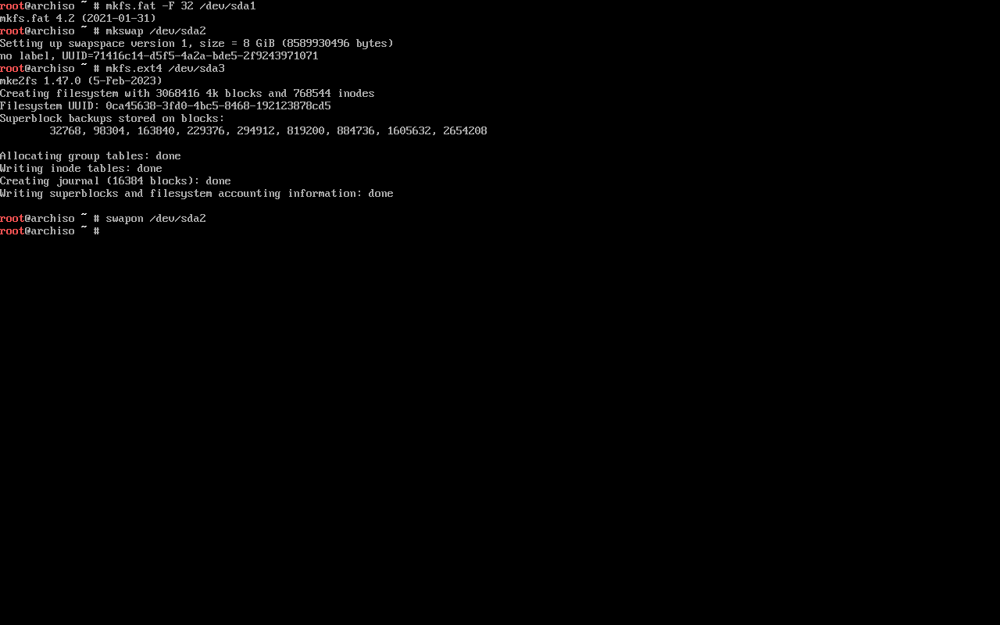

# ArchLinux 系统安装


一个简单、轻量级的发行版，试图保持简单。

<!--more-->

## 制作 `ArchLinux` 启动盘

### `ArchLinux` 镜像文件下载

以下提供两种下载方式：

- 通过 `ArchLinux` 官网下载

[官网下载wiki](https://archlinux.org/download/)

```txt
Current Release: 2023.04.01
Included Kernel: 6.2.8
ISO Size: 809.3 MB
```

[Magnet link for 2023.04.01](magnet:?xt=urn:btih:6df99344a488592ba3f71ffaef964a1dbfe0c8ed&dn=archlinux-2023.04.01-x86_64.iso)

[Torrent for 2023.04.01](https://archlinux.org/releng/releases/2023.04.01/torrent/)

- 通过清华源下载

[archlinux-2023.04.01-x86_64.iso](https://mirrors.tuna.tsinghua.edu.cn/archlinux/iso/2023.04.01/archlinux-2023.04.01-x86_64.iso)

[archlinux-2023.04.01-x86_64.iso.torrent](https://mirrors.tuna.tsinghua.edu.cn/archlinux/iso/2023.04.01/archlinux-2023.04.01-x86_64.iso.torrent)

----

### 制作 `ArchLinux` 启动盘

以下提供两种制作方式：

- `rufus`

首先准备一个内存大于 8G 的 U 盘，使用 [`rufus`](https://github.com/pbatard/rufus) 制作启动盘，根据界面操作完成。

- `dd`

`Linux` 用户可使用 `dd` 命令完成启动盘的制作。

```bash
dd bs=4M if=path/to/archlinux-version-x86_64.iso of=/dev/sdx conv=fsync oflag=direct status=progress
```

----

## `ArchLinux` 系统安装

### 1. 设置安装方式

- 如果是在虚拟机 `VMWare` 中安装，选择相应的镜像文件即可

- 如果是在电脑上安装，需要设置为从 U 盘启动安装。

### 2. 安装启动过程

开始安装 `ArchLinux` 系统可以看到安装启动界面



选择 `Arch Linux install medium (x86_64, BIOS)` 下一步


下面就开始正式配置安装 `ArchLinux`

### 3. 验证启动模式

执行以下命令验证启动模式，如果命令显示的目录没有错误，则系统以 `UEFI` 模式启动。如果该目录不存在，系统可能会以`BIOS`（或`CSM`）模式启动。

```bash
ls /sys/firmware/efi/efivars
```


### 4. 验证网络连接

因为安装 `ArchLinux` 需要下载软件包，所以需要网络连接。

```bash
ping baidu.com
```


### 5. 创建硬盘分区

使用 `fdisk -l` 或者 `lsblk -f` 来查看硬盘分区


使用 `cfdisk /dev/sda` 命令来进行分区，其中 `/dev/sda` 为需要安装系统的分区，可能会有所不同。

**ArchLinux 官方建议分区**

- `UEFI` 与 `GPT`

| 挂载点     | 分区                      | 分区类型                | 建议大小                                       |
| ---------- | ------------------------- | ----------------------- | ---------------------------------------------- |
| /mnt/boot1 | /dev/efi_system_partition | EFI 系统分区            | 至少 300 MiB。如果打算安装多个内核，至少 1 GiB |
| [SWAP]     | /dev/swap_partition       | Linux swap (交换空间)   | 大于 512 MiB                                   |
| /mnt       | /dev/root_partition       | Linux x86-64 根目录 (/) | 剩余空间                                       |

- `BIOS` 与 `MBR`

| 挂载点 | 分区                | 分区类型              | 建议大小     |
| ------ | ------------------- | --------------------- | ------------ |
| [SWAP] | /dev/swap_partition | Linux swap (交换空间) | 大于 512 MiB |
| /mnt   | /dev/root_partition | Linux                 | 剩余空间     |


选择 `gpt` 类型


点击 `New` 新建分区1 (`efi` 分区)


输入分区1大小：300M


点击 `New` 新建分区2 (`swap` 分区)


输入分区2大小：16G，一般建议为内存的 `1 ~ 1.5` 倍，这里我选择 `16G`。


点击 `New` 新建分区3 (根文件分区)


设置分区1 (`efi` 分区) 为 `EFI System`


设置分区2 (`swap` 分区) 为 `Linux swap`


选择 `Write` 输入 `yes` 保存分区设置，其中 `/dev/sda1` 为 `efi` 分区，`/dev/sda2` 为 `swap` 分区，`/dev/sda3` 为根文件分区。


选择 `Quit` 退出分区设置


设置分区完成，检查下分区是否正常

```bash
fdisk -l
```


### 6. 格式化分区

```bash
# EFI分区格式化
mkfs.fat -F 32 /dev/sda1

# 创建swap分区
mkswap /dev/sda2

# root分区格式化
mkfs.etx4 -f /dev/sda3
```



### 7. 挂载分区

```bash
# 挂载根文件目录
mount /dev/sda3 /mnt

# 挂载efi分区
mount --mkdir /dev/sda1 /mnt/boot/efi

# 启用swap分区
swapon /dev/sda2
```

### 8. 安装 ArchLinux 系统

- 编辑 `/etc/pacman.d/mirrorlist` 文件修改清华源

```bash
vim /etc/pacman.d/mirrorlist
```

修改 `Server` 为 `https://mirrors.tuna.tsinghua.edu.cn/archlinux/$repo/os/$arch`


- 更新软件包

```bash
pacman -Syy
```


- 安装必需的软件包

```bash
pacstrap -K /mnt base base-devel linux linux-firmware sof-firmware vim
```


### 9. 生成 fstab 配置

```bash
genfstab -U /mnt >> /mnt/etc/fstab
```

### 10. 进入安装的 ArchLinux 系统

```bash
arch-chroot /mnt
```


### 11. 设置时区

```bash
ln -sf /usr/share/zoneinfo/Asia/Shanghai /etc/localtime
hwclock --systohc
```

### 12. 本地化

- 编辑 `/etc/locale.gen` 文件，取消 `en_US.UTF-8 UTF-8` 和 `zh_CN.UTF-8 UTF-8` 注释。

```txt
en_US.UTF-8 UTF-8

zh_CN.UTF-8 UTF-8
```

- 生成 `Locale`

```bash
locale-gen
```


- 系统区域设置

编辑 `/etc/locale.conf` 文件，设置 `LANG`

```txt
LANG=en_US.UTF-8
# LANG=zh_CN.UTF-8
```

注意：这里使用英文编码，因为还没有安装中文字体，指定 `LANG` 为 `zh_CN`，显示会出现乱码。后面会有安装中文字体的配置

### 12. 设置 `root` 用户密码

```bash
passwd root
```


### 13. 设置主机名

```bash
echo "$HOSTNAME" > /etc/hostname
```

### 14. 网络配置

```bash
# 安装networkmanager
pacman -S networkmanager

# 设置为自启动
systemctl enable NetworkManager.service
```


### 15. 新建普通用户

- 添加普通用户

```bash
useradd -m -G wheel user
```

- 设置普通用户密码

```bash
passwd user
```

- 设置 `sudo` 权限

修改 `/etc/sudoers` 文件，取消 `wheel` 组和 `sudo` 组的执行权限

```txt
## Same thing without a password
%wheel  ALL=(ALL:ALL) ALL

## Uncomment to allow members of group sudo to execute any command
%sudo   ALL=(ALL:ALL) ALL
```

### 16. 安装引导程序

- 安装引导程序

```bash
pacman -S grub efibootmgr
```

- 安装微码

如果有 `Intel` 或 `AMD` 的 CPU，请另外启用微码更新。

使用 `cat /proc/cpuinfo` 命令查看 cpu 型号

```bash
cat /proc/cpuinfo
```

如果是 `Intel CPU`，安装 `intel-ucode`

```bash
pacman -S intel-ucode
```

如果是 `AMD CPU`，安装 `amd-ucode`

```bash
pacman -S amd-ucode
```

- 安装引导程序

```bash
grub-install --target=x86_64-efi --efi-directory=/boot/efi --bootloader-id=GRUB
```


**如果出现 `grub-install error`，需要检查启动模式，设置为 `UEFI` 方式启动**


如果使用 `VMWare` 虚拟机方式安装 `ArchLinux`，需要修改虚拟机设置->选项->固件类型->UEFI。


- 生成引导配置文件

```bash
grub-mkconfig -o /boot/grub/grub.cfg
```


### 17. 重启

```bash
exit
umount -R /mnt
reboot
```

----


