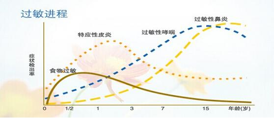

# 婴幼儿过敏防治

## 认识过敏与预防策略

### 了解过敏性疾病的危害

过敏性疾病是 18 岁以下少年儿童的第三大常见疾病，排名第五的慢性病，在中国和发达国家一样也呈快速上升趋势。

### 什么是过敏

过敏反应，学名**变态反应**，是身体对一种或多种致敏物质的不正常反应，而这些物质对大多数人是无害的。其主要起因是由于过敏患者体内产生了过多的免疫球蛋白E（lgE）抗体。它可以和环境中的过敏原起反应，刺激机体产生和释放能量的化学物质，继而产生各种症状。

常见的过敏症状有：过敏性鼻炎、哮喘、结膜炎、湿疹、食物过敏性胃肠炎等。

### 过敏的进程

过敏的一个临床表现发展到另外一种表现的发展过程就叫过敏进程，它是童年过敏性疾病的自然进程。

### 婴幼儿为什么容易过敏

**过敏内在因素：**

- 家族遗传
    - 过敏性疾病的家族史是婴幼儿发生过敏的突出危险因素
- 肠道屏障
    - 宝宝的肠道屏障不完善
- 免疫系统
    - 初生婴儿免疫系统发育不成熟

----

## 牛奶蛋白过敏认识及规范化处理

### 什么是牛奶蛋白过敏症

机体对一种或多种牛奶蛋白质发生的免疫学反应。在临床上，其异常表现多重复出现，并且其发病涉及到一种或多种免疫学机制。

### 为什么容易发生牛奶蛋白过敏

1️⃣  肠道屏障功能不成熟

宝宝的肠道小卫士 - 肠道菌群还未完全建立，宝宝的肠道屏障还有缝隙，容易被过敏原钻空子，从肠道缝隙进入血液，引起过敏。

2️⃣  免疫系统发育不成熟

Th1/Th2 细胞平衡对整个免疫系统的调节起着关键性的作用，而婴幼儿系统免疫系统中 Th1 偏低，Th2 偏高。

宝宝出生后过免疫系统进行早期训练有利于减低过敏的发生。同时，减少或避免异体食物蛋白的摄入也有利于减低过敏发生。

3️⃣  肠道内正常菌落破坏增多

大量抗生素应用 -> 肠道内正常菌落破坏增多 -> 肠道屏障完整性受到损害

### 婴幼儿过敏的常见症状

| 器官   | 症状                           |
| :----- | :----------------------------- |
| 胃肠道 | 呕吐🤮、腹泻、便秘💩、便血     |
| 皮肤   | 特应性皮炎、血管性水肿、荨麻疹 |
| 呼吸道 | 流涕、慢性咳嗽、气喘           |
| 全身   | 持续性的烦躁或肠绞痛           |


**牛奶蛋白过敏没有特定的症状！**


90% 出现对牛奶蛋白过敏反应的婴儿都小于 3 月龄，或在接触牛奶蛋白之后 2 个月内出现过敏。

- 一岁以后：少有出现，50% 能缓解
- 二岁以后：75% 能缓解
- 三岁以后：90% 能缓解

## 总结

- 过敏基因🧬
- 环境污染
- 婴儿的免疫系统发育不完善
- 肠胃道屏障功能发育不完善
- 胃肠道缺乏消化酶、益生菌等物质

## 预防牛奶蛋白过敏的有效措施

婴儿喂养的首选是母乳，正常饮食的妈妈纯母乳喂养婴儿是防治的金标准。


妈妈在怀孕期大量进食鸡蛋、牛奶或有壳海鲜等可能导致宫内致敏。


1️⃣  孕期

- 补充益生菌
- 回避可预见的过敏环境和风险

2️⃣  分娩期

- 自然分娩

3️⃣  哺乳期

- 母乳喂养
- 水解蛋白奶粉或补充益生菌

4️⃣  辅食添加期

- 对于过敏高风险婴儿延迟引入不该添加的辅食

----

